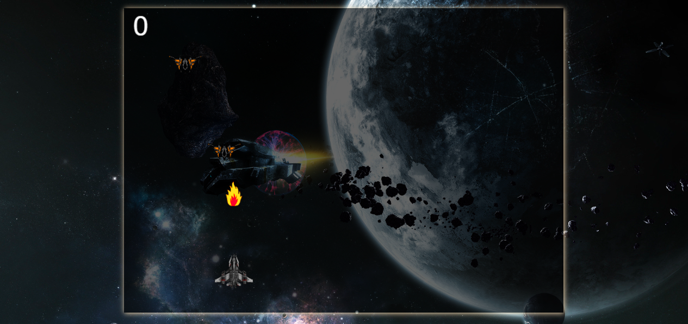

# 🚀 Space Strikers 🌌

## Welcome to Space Strikers!

Embark on an interstellar adventure with **Space Strikers**—a thrilling space war game where you pilot a starship, battle alien invaders, and aim for the highest score. Dive into a galaxy filled with action-packed gameplay and stunning visuals.

### Screenshots:

### Features:

- **Intense Space Battles**: Control your starship and engage in epic battles against alien enemies.

- **Customizable Controls**: Start Game feature and Rules.

- **Challenging Enemies**: Face increasingly difficult adversaries and test your skills.

### Technologies Used:

- **HTML5**: For structuring the game interface.
- **CSS3**: For styling and animations.
- **JavaScript**: For game mechanics and interactions.
- **Canvas API**: For rendering the game graphics.

### Live Demo

Play the game and explore the galaxy [here](https://farhansahibzada.github.io/Space-Strikers-Game/).

### Contact

For questions, feedback, or just to connect, feel free to reach out:

- **Name**: [Farhan Sahibzada]
- **Email**: [farhansahabzada3@gmail.com]
- **GitHub**: [Github Profile](https://github.com/FarhanSahibzada) 
